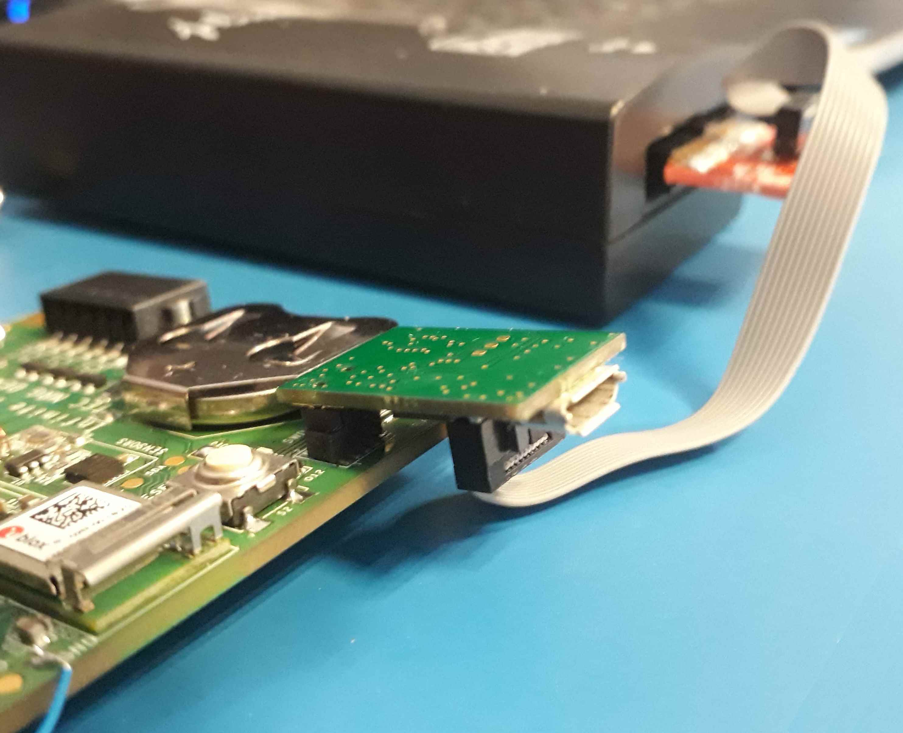

# Introduction
This repository contains the code for the Technology group's Infinite IoT energy harvesting board.

# Fetching and Building
Import this code with:

`mbed import https://github.com/u-blox/infinite-iot`

Set your Mbed target to `AQ_NRG`, set your desired toolchain and then build the code with:

`mbed compile`

If you want a debug build (i.e. with optimisation off so that you can do source-level single-step in a debugger) use `ARM` toolchain instead of `GCC_ARM` as the unoptimized GCC one won't fit in the available flash.

# Loading Code
To load a binary onto the Infinite IoT board you will need the following equipment:

1.  An adapter board, the one which forms part of the [u-blox B200 blueprint](https://www.u-blox.com/sites/default/files/Blueprint-B200_ApplicationNote_%28UBX-16009187%29.pdf); this plugs into the 10-way debug connector on the Infinite IoT board.
2.  An Olimex [ARM-JTAG-20-10](https://www.olimex.com/Products/ARM/JTAG/ARM-JTAG-20-10/) adapter board; the cable that comes with this board plugs into the header on the above adapter-board.
3.  A Segger [J-Link Base](https://www.segger.com/products/debug-probes/j-link/models/j-link-base/) debugger; the PCB header of the ARM-JTAG-20-10 adapter board plugs directly into this.

You will also need to install the Segger [JLink tools](https://www.segger.com/downloads/jlink/JLink_Windows.exe).

First, connect the Segger, Olimex cable and adapter board to the Infinite IoT board like this:

A binary can then be loaded using Segger's JLink Flash Lite.  Launch the JLink Flash Lite utility and chose `NRF52832_XXAA` as the device type; the interface will default to SWD and 4000 kHz, which is fine.  Select the `.hex` file you built above and then press Program Device.  A dialogue box should appear showing several bars of progress and then "done".  Reset the board and the binary will begin running.

# Server Side
This infinite-iot software will send JSON-coded data to `IOT_SERVER_IP_ADDRESS` and `IOT_SERVER_PORT` (configured in `eh_config.h` and overridable in `mbed_app.json`).  A Python script, `udp-json-mongo.py` is included here which can be run on the server and will dump any received JSON into a Mongo database; Mongo is particularly suitable for this purpose since it is natively JSON.  A Mongo database must be installed on your server and `mongod` should be running (with something like `sudo mongod --config /etc/mongodb.conf`).  [PyMongo](http://api.mongodb.com/python/current/index.html) also needs to be installed with something like:

`sudo pip2.7 install pymongo`

Then run the (Python 2) script, `udp-json-mongo.py`, giving it the public IP address of the server, the port and the Mongo database name and collection to write the JSON to, as parameters.  To run the script in the background, use `nohup` (something like `nohup python udp-json-mongo.py <parameters> &`).  Note that `nohup` will, by default, write what would have been written to the console to a file `nohup.out`; this is very useful but the file can get quite large so, to empty it, just manually execute the command `>nohup.out` every so often (after copying away the old file if you wish).

FYI, the Mongo shell can be entered by typing:

`mongo`

Useful Mongo commands are:

* Show the databases: `show dbs`.
* Use a database (e.g. infinite-iot): `use infinite-iot`.
* Show the collections in a database: `show collections`.
* Display the contents of a collection (e.g. incoming) after "use"ing the relevant database: `db.incoming.find()`.
* Remove an entire collection (e.g. incoming) after "use"ing the relevant database: `db.incoming.remove({})`.
* Return the unique values of a field (e.g. the field "n"): `db.incoming.distinct("n")`. 
* Find all records in a collection with a given value of the field "n" (in the case of infinite-iot the "n" field is the IMEI of the originating modem, in this example 357520077934038): `db.incoming.find({"n": "357520077934038"})`.
* Print the timestamp of all the records in a collection (e.g. incoming): `db.incoming.find().forEach(function(x) {print("Timestamp: " + x._id.getTimestamp());})`.
* Find all records in a collection on or before a given date (e.g. incoming and 18th Feb 2017) [replace `find` with `remove` to delete the records instead]: `db.incoming.find({$where: "this._id.getTimestamp() < new Date('Feb 18 2017 00:00:00 GMT+00:00')"})`.
* As above, but specifying another field value also: `db.incoming.find({$and: [{$where: "this._id.getTimestamp() < new Date('Feb 18 2017 00:00:00 GMT+00:00')"}, {n:'357520077934038'}]})`.

Mongo is not SQL, everything is coded as json.  It's quite logical, just a bit more programming-oriented and verbose than SQL.  Go look at their website for how to code queries etc.