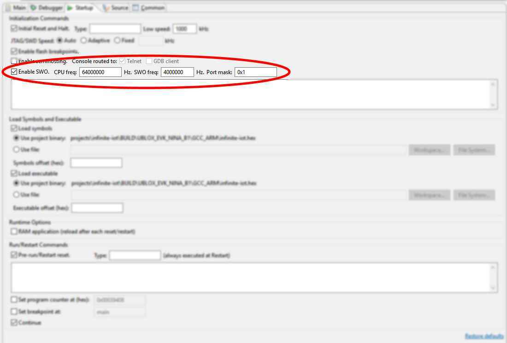

# Outline
In outline, this is how the energy harvesting code is structured:

- There are `eh_` modules and `act_` modules: `eh_` modules form the main structure while `act_` modules are actions that can be taken when enough energy is available.  The modules are all written in C, though they may instantiate C++ entities.
- At power-on `eh_post` performs a power-on self test, calling all of the `act_` modules in turn to check them out and, while checking out the `act_modem` module, it also determines what kind of modem is attached (SARA-R410 or SARA-N211).
- With this done, `eh_processor` is called.  `eh_processor` first checks that there is enough energy to continue; if there is not it returns immediately.  If there is sufficient energy to continue it looks at the power sources available to it and determines which one should be used for the next period.  Then it looks through the history of previous actions and uses that to determine the optimal order of actions to take next.  When it has made a list of actions it executes the corresponding `act_` modules as rapidly as possible in parallel tasks and then returns, hopefully without running out of energy, marking each action as either completed or aborted.
- When `eh_processor` returns the system is put to sleep, RAM retained, until either an RTC timer expires, motion is detected or a magnetic field is detected, at which point `eh_processor` is called again, etc.
- Each `act_` module may produce output in the form of a data structure which is held in RAM. The `eh_data` module stores these data structures in a sorted list. The `act_modem` module is the only thing that can empty the list, sending the data off to a server on the internet then deleting the data item. The possible actions are:
    - `act_voltage`: measure an analogue voltage,
    - `act_cellular`: measure cellular parameters,
    - `act_temperature_humidity_pressure`: measure the environment, implemented by `act_bme280`,
    - `act_light`: measure light levels, implemented by `act_si1133`,
    - `act_magnetic`: measure magnetic field strength, implemented by `act_si7210`,
    - `act_acceleration`: measure acceleration, implemented by `act_lis3dh`,
    - `act_position`: measure position, implemented by `act_zoem8`,
    - `act_modem`: make a report to the server or get the internet time,
    - `ble`: search for BLE devices, implemented by the NINA-B1 module itself.
- There are also data structures which may be added to the list without an associated action, such as statistics on device operation, logging, etc.
- The data structures are coded in JSON by the `eh_codec` module for sending to the server.
- The single configuration file, `eh_config.h`, specifies what pins are used for what, I2C addresses of the sensors, modem details (APN etc.);  configuration items can also be overridden in `mbed_app.json`.

# Debugging
The Segger JLink-base, as configured for loading binaries onto the Infinite IoT board, can be used to debug the NINA-B1 in the usual way.  The important configuration screens for running a debug session in Eclipse are shown below:


Note that the `infinite-iot.hex` file is the C/C++ Application but, in the Startup tab, the symbols are loaded from `infinite-iot_application.elf` (while the loaded executable on the same page remains `infinite-iot.hex`).  The debugger doesn't have symbol information for the initial boot and can sometimes get confused so it is best to switch to assembler instruction stepping, do a couple of steps to make sure it's working, then switch back to source level stepping and press "run"; you should end up at a temporary break-point in `main()`.  I also found that if the debug session does not end cleanly GDB is sometimes unable to start the Segger, complaining about it being low on memory; the Segger just needs its USB cable unplugged and plugged in again to clear things up.

The NINA-B1 module on the Infinite IoT board has only one serial port and this is connected to the cellular modem on the board, hence normal `printf()`-style debug is not possible and is, by default, switched off.  If the modem is powered down, an FTDI cable could be soldered to pads on the Infinite IoT board to allow `printf()` debug.

To switch on `printf()` debug, add the following to `mbed_app.json`:

```
    "config": {
        "enable_printf": true
    }
```

However, if the Segger JLink-base is connected to the board then `printf()` output can be re-directed to the SWO pin of the debug header.  To redirect prints to `SWO`, add the following entry to `mbed_app.json`:

```
{
    "target_overrides": {
        "UBLOX_EVK_NINA_B1": {
            "target.macros_add": ["ENABLE_PRINTF_SWO"]
        }
     }
}
```

`SWO` prints can then be viewed in several PC applications.  The instructions [here](https://mcuoneclipse.com/2016/10/17/tutorial-using-single-wire-output-swo-with-arm-cortex-m-and-eclipse/) show how to set them up.  For Segger's `jLinkSWOViewerCL` the correct command-line is `jLinkSWOViewerCL -device NRF52832_XXAA` while for Eclipse you need the following settings in your debugger tabs (already shown in the pictures above, but just for emphasis):




To confirm that this is working, try loading the `swo_hello_world.hex` from this directory onto the Infinite IoT board and then resetting it.  Viewing the output with Segger's `jLinkSWOViewerCL`, you should see something like this:

```
************************************************************
*               SEGGER Microcontroller GmbH                *
*   Solutions for real time microcontroller applications   *
************************************************************
*                                                          *
*      (c) 2012 - 2017  SEGGER Microcontroller GmbH        *
*                                                          *
*     www.segger.com     Support: support@segger.com       *
*                                                          *
************************************************************
*                                                          *
* SEGGER J-Link SWO Viewer   Compiled Apr 30 2018 15:46:03 *
*                                                          *
************************************************************

------------------------------------------------------------
Usage:
  In the configuration dialog enter the target CPU frequency
  or the target device name.
  SWO Viewer can show data from stimulus ports 1 to 16.
  0 - 9 and a - f keys toggle display of stimulus port data.
  Ctrl-C and any other key closes SWO Viewer
------------------------------------------------------------


Target CPU (NRF52832_XXAA) is running @ 64672 kHz.
Receiving SWO data @ 0 kHz.
Showing data from stimulus port(s): 0
-----------------------------------------------
Hello world 0.
Hello world 1.
Hello world 2.
Hello world 3.
Hello world 4.
Hello world 5.
Hello world 6.
Hello world 7.
Hello world 8.
Hello world 9.
Hello world 10.
Hello world 11.
Hello world 12.
Hello world 13.
Hello world 14.
Hello world 15.
Hello world 16.
...
```

Otherwise, when the modem is required and no debugger is connected, local debug is via one single colour LED.  The module `eh_morse` provides a Morse code LED flash for last resort debug.

Finally, during normal operation, logging information is also written to data structures by the `log-client` library and these data structures are transmitted to the server, along with everything else, where they can be [decoded](https://github.com/u-blox/log-converter) and examined. Note, however, that this is necessarily very low bandwidth (and tightly packed) logging.
